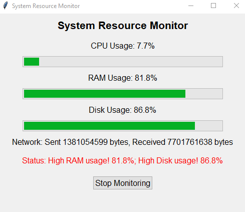
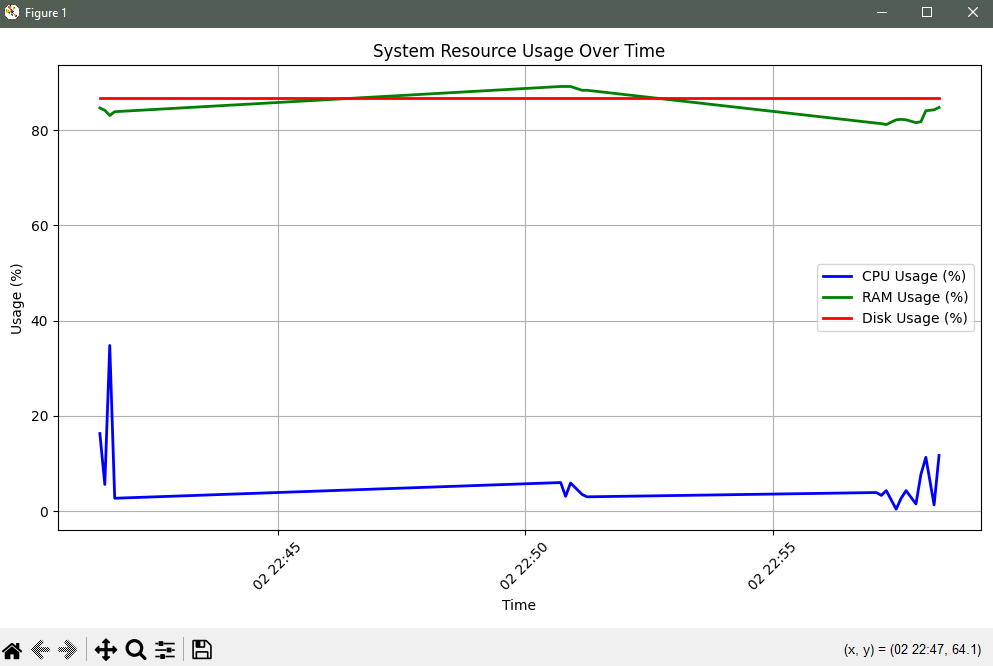

# 🖥️ System Resource Monitor

A Python-based desktop application to monitor **CPU, RAM, Disk, and Network usage** in real-time using a GUI built with **Tkinter**. It logs system stats, sends **email alerts** on high usage, and generates a **usage graph** when monitoring stops.

---

## 📸 Output Screenshot

> GUI during live monitoring



---

## 📈 Sample Usage Graph

> Auto-generated after stopping the monitor



---

## 🚀 Features

- ✅ Real-time monitoring of system resources
- ✅ Interactive GUI with progress bars
- ✅ Data logging to `system_stats.csv`
- ✅ Email alerts for high resource usage
- ✅ Graph of usage trends on stop
- ✅ Network sent/received tracking

---

## 🛠️ Technologies Used

- **Python**
- `psutil` – system resource access
- `tkinter` – GUI
- `csv` – logging
- `matplotlib` – graph plotting
- `pandas` – graph data handling
- `smtplib` – email alert system

---

## ⚙️ Requirements

Install the required libraries:

```bash
pip install psutil matplotlib pandas
```

---

## ✉️ Email Alert Setup

Enable 2-Step Verification on your Gmail account and create an [App Password](https://support.google.com/accounts/answer/185833).

Replace these placeholders in the code:

```python
EMAIL_ADDRESS = "your_email@gmail.com"
EMAIL_PASSWORD = "your_app_password"
TO_EMAIL = "recipient_email@example.com"
```

> ⚠️ **Never use your main Gmail password!**

---

## 📋 How It Works

1. **Monitor Loop**:
   - Reads CPU, RAM, Disk, and Network stats every 5 seconds
   - Updates GUI in real-time
   - Writes data to `system_stats.csv`

2. **Email Alerts**:
   - If usage > 80% for **3 consecutive checks**
   - Sends email alert for CPU, RAM, or Disk

3. **Graph Generation**:
   - On stopping the app or closing the window
   - Plots and shows usage graph from `system_stats.csv`

---

## 📁 Project Structure

```
system-monitor/
├── monitor.py            # Main program file
├── system_stats.csv      # Logs resource usage (auto-generated)
├── output.png            # Screenshot of GUI
├── graph.png             # Screenshot of usage graph
└── README.md             # This file
```

---

## ▶️ How to Run

```bash
python monitor.py
```

- The GUI will open and begin monitoring
- Click **Stop Monitoring** to exit and view the graph

---

## ✅ Sample Alerts

If usage exceeds 80% for 3 consecutive checks:

```
⚠️ High CPU usage! 89.2%
Email sent: System Monitor Alert: High CPU Usage
```

---

## 🔒 Security Tip

Use environment variables for passwords:

```python
import os
EMAIL_PASSWORD = os.getenv("EMAIL_PASSWORD")
```

Then run with:

```bash
EMAIL_PASSWORD=your_app_password python monitor.py
```

---

## 🚀 Future Ideas

- Add sound alerts
- Export report to PDF
- Run in system tray
- Slack or Telegram alerts

---

## 🙋‍♂️ About

Created by **Vishnu Dev P**  
🔗 [GitHub Profile](https://github.com/vishnudev-p)  
📧 Reach out at: your_email@example.com

---

## 📜 License

Open-source project for educational use only.
